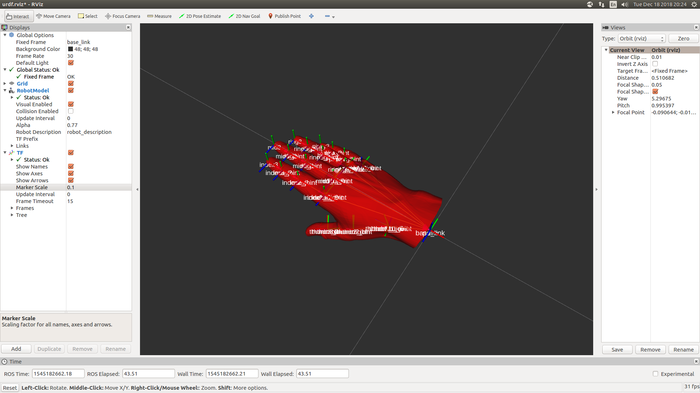

# GraspIt2URDF
Simple Python utility to convert hand model from GraspIt! to a ROS-compatible URDF. An example of the conversion of  `HumanHand20DOF.xml` from GraspIt! is included. 

## Quick demo
Install the [urdf_tutorial](http://wiki.ros.org/urdf_tutorial) package, and then run `roslaunch urdf_tutorial display.launch model:=urdf/HumanHand20DOF.urdf` from the root of this repository. You should see GraspIt!'s 20-dof human hand model in Rviz, with sliders to manipulate the joints:

## Converting a GraspIt! hand to URDF
- Create a directory in `data`, named with the GraspIt! robot name (e.g. `HumanHand20DOF`). It will hold the meshes and data files for your URDF model.
- Convert all `.wrl` files from `~/.graspit/models/robots/<ROBOT_NAME>/iv` into `.stl` files of the same name (using Meshlab) and save them to `data/<ROBOT_NAME>`.
- Next, you need to find the inertia tensors and centers of mass of all the links.
  - I have included a [Meshlab script](data/HumanHand20DOF/info_script.mlx) that computes these for you. In short, it first closes holes in the link mesh, ensures watertightness by doing a simple Poisson reconstruction, and then computes the required quantities.
  - You can run it like so, from inside `data/<ROBOT_NAME>`: `meshlab.meshlabserver -s info_script.mlx -i thumb2.wrl`.
  - It should print out the required physical quantities towards the end. You need to make a text file of the same name (e.g. `thumb2.txt`) containing the inertia tensor on the first line and the center of mass on the second line. See the included example files in `data/HumanHand20DOF`.
  - For info about which values to include, see [this article](http://gazebosim.org/tutorials?tut=inertia). The `1/s^5` scaling mentioned in that article is already implemented in the code.
- Next step is to convert! Run e.g. for the human hand: `python graspit2urdf.py --input_filename ~/.graspit/models/robots/HumanHand/HumanHand20DOF.xml`, and it should create `HumanHand20DOF.urdf` in the `urdf` directory for you.
- You can test this URDF in Rviz by first installing the [urdf_tutorial](http://wiki.ros.org/urdf_tutorial) package and running `roslaunch urdf_tutorial display.launch model:=urdf/<your-urdf-file>.urdf`, as mentioned in [this ROS Wiki article](http://wiki.ros.org/urdf/Tutorials/Building%20a%20Visual%20Robot%20Model%20with%20URDF%20from%20Scratch).
